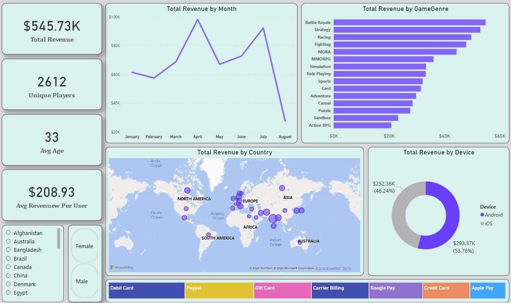
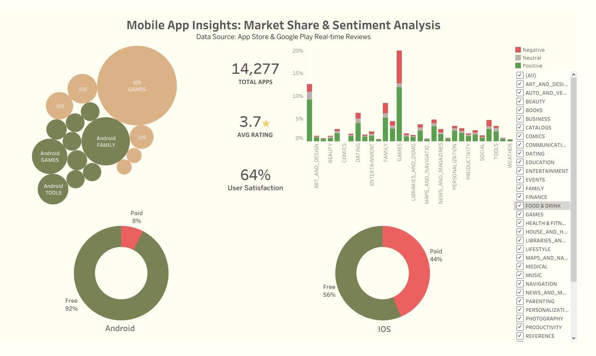

# Mobile-Store-Revenue-Analysis
End-to-end data analysis project using SQL for data extraction, Power BI and Tableu for financial visualization
# Financials & Market Insights

## Overview
This repository contains a comprehensive data analysis of the mobile gaming sector. The project is split into two distinct parts:
1. **Financial Performance Analysis:** Deep dive into internal game transactions and user behavior.
2. **Market Comparison:** Analyzing the competition between Android and iOS app stores.

## Tech Stack
- **SQL:** Data cleaning, table joins, and complex "Whale" behavior analysis.
- **Power BI:** Interactive dashboards, DAX metrics (ARPU), and UI/UX design.

---

## Dashboard 1: Financial & User Behavior Analysis
*Focus: Revenue trends, monetization efficiency, and demographics.*

### **Key Insights:**
- **The "India Whale" Discovery:** My SQL analysis revealed that a massive revenue spike in April was driven by only **three high-spending users ("whales")** in India, rather than mass popularity.
- **Monetization:** The **ARPU (Average Revenue Per User) is $231.55**, showing strong loyalty from the core player base.
- **Seasonal Peaks:** April is the most profitable month, significantly outperforming August.

---

## 📊 Dashboard 2: App Store Market Research
*Focus: Comparing Android vs. iOS ecosystem and category dominance.*

### **Key Insights:**
- **Platform Strategy:** **iOS users are 6 times more likely to buy paid apps** compared to Android users, where 93% of the market is free-to-play.
- **Category Trends:** Games and Social Networking dominate the app counts, but the "Sentiment Analysis" shows that niche categories often have higher user satisfaction.
- **Category Unification:** Used complex SQL `CASE` statements to merge messy category names from different platforms for a clean comparison.

---

## SQL Highlights
I used SQL to turn raw data into clean, actionable insights. Key techniques include:
- **CTEs & Window Functions:** To rank categories and analyze user purchase frequency.
- **Data Sanitization:** Cleaning up platform-specific naming conventions.
- **Behavioral Analysis:** Identifying "super-users" to avoid skewed data interpretations.

---
*Created by [Nikolay Nikolov] - Data Analyst Portfolio 2026*
